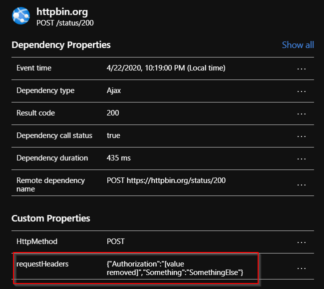

# Microsoft Application Insights Filtering Plugin example in React

This project is based on [Microsoft Application Insights JavaScript SDK - React Plugin](https://github.com/microsoft/ApplicationInsights-JS/tree/master/extensions/applicationinsights-react-js)

## What this demonstrates

This project has a TypeScript module which gets injected into the Application Insights extension modules and allows for filtering out or replacing specific header values
when AJAX or Fetch requests are executed.




## Configuration

In [App.jsx](https://github.com/martijnhoogendoorn/applicationinsights-react-httpheaderfiltering-js/blob/master/src/App.jsx), define the proper instrumentation key for Application Insights.
In [TelemetryService.js](https://github.com/martijnhoogendoorn/applicationinsights-react-httpheaderfiltering-js/blob/master/src/TelemetryService.js), check out the chain for the plugins, 

```js
    filterPlugin = new HttpHeaderFilterPlugin();

    extensions: [reactPlugin, filterPlugin],
```

as well as the configuration for the extension

```js
    [filterPlugin.identifier]: {
        filteredHttpHeaders: {
            Authorization: '[value removed]',
            SomeOtherThing: null,
        }
    },
```

This configuration replaces the 'Authorization' header configured for XMLHttpRequest and Fetch operations, and removes the header added to Fetch (the two last buttons of the demo).

Note in the developer tools that the actual request DOES contain these headers, but Application Insights requests (/track) doesn't log them in the base data, e.g.
```json
[
  {
    "time": "2020-04-22T20:19:55.224Z",
    "iKey": "401d9df3-caba-4ad3-9a76-df52496ba33a",
    "name": "Microsoft.ApplicationInsights.401d9df3caba4ad39a76df52496ba33a.RemoteDependency",
    "tags": {
      "ai.user.id": "AQXak",
      "ai.session.id": "aL1J1",
      "ai.device.id": "browser",
      "ai.device.type": "Browser",
      "ai.operation.name": "/",
      "ai.operation.id": "d074529469c24b9a8dbbe06e3c856dc1",
      "ai.internal.sdkVersion": "javascript:2.5.4"
    },
    "data": {
      "baseType": "RemoteDependencyData",
      "baseData": {
        "id": "|d074529469c24b9a8dbbe06e3c856dc1.4037daf6b4d04f84",
        "ver": 2,
        "name": "POST https://httpbin.org/status/200",
        "resultCode": "200",
        "duration": "00:00:00.207",
        "success": true,
        "data": "POST https://httpbin.org/status/200",
        "target": "httpbin.org",
        "type": "Ajax",
        "properties": {
          "HttpMethod": "POST",
          "requestHeaders": "{\"Authorization\":\"[value removed]\",\"Something\":\"SomethingElse\"}"
        },
        "measurements": {}
      }
    }
  }
]
```
Notice the "Authorization" header has "[value removed]", and the header "SomeOtherThing" is not present (while it is present in the actual request, just filtered out for telemetry capture).

## Available Scripts

In the project directory, you can run:

### `npm install`

Installs dependencies. You can also use `yarn install`.

### `npm start`

Runs the app in the development mode.<br>
Open [http://localhost:3000](http://localhost:3000) to view it in the browser.

The page will reload if you make edits.<br>
You will also see any lint errors in the console.

### `npm test`

Launches the test runner in the interactive watch mode.<br>
See the section about [running tests](https://facebook.github.io/create-react-app/docs/running-tests) for more information.

### `npm run build`

Builds the app for production to the `build` folder.<br>
It correctly bundles React in production mode and optimizes the build for the best performance.

The build is minified and the filenames include the hashes.<br>
Your app is ready to be deployed!

See the section about [deployment](https://facebook.github.io/create-react-app/docs/deployment) for more information.

### `npm run eject`

**Note: this is a one-way operation. Once you `eject`, you can’t go back!**

If you aren’t satisfied with the build tool and configuration choices, you can `eject` at any time. This command will remove the single build dependency from your project.

Instead, it will copy all the configuration files and the transitive dependencies (Webpack, Babel, ESLint, etc) right into your project so you have full control over them. All of the commands except `eject` will still work, but they will point to the copied scripts so you can tweak them. At this point you’re on your own.

You don’t have to ever use `eject`. The curated feature set is suitable for small and middle deployments, and you shouldn’t feel obligated to use this feature. However we understand that this tool wouldn’t be useful if you couldn’t customize it when you are ready for it.
